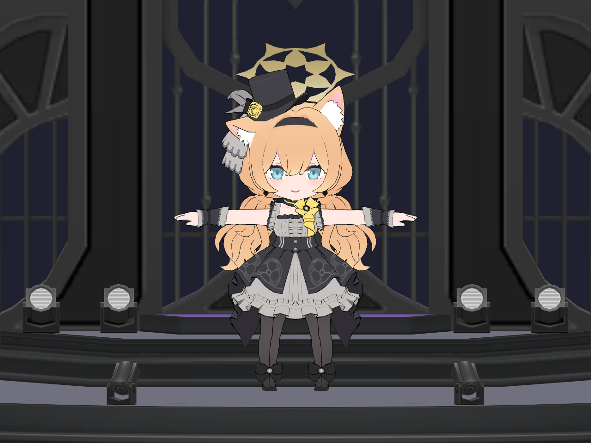

# 마리 점프게임 (MariJump)

블루 아카이브의 이오치 마리를 주인공으로 만드는 Unity 점프게임입니다.
개인 학습과 취미 개발을 위한 비공식 팬 프로젝트입니다.

## 개발 현황

현재는 게임 제작을 위한 프로젝트와 3D 모델을 준비한 단계입니다.

- Unity 및 URP 설정 완료
- 아이돌 마리와 무대 모델 적용, 프리팹과 미리보기 씬 구성
- 점프 조작, 충돌 판정, 관절 리깅 및 캐릭터 애니메이션 미구현

## 개발 환경

| 항목 | 버전 |
|---|---|
| Unity Editor | 6000.5.4f1 |
| Universal Render Pipeline | 17.5.0 |

## 프로젝트 열기

1. 저장소를 내려받고 Unity Hub에서 프로젝트 폴더를 추가합니다.
2. Unity 6000.5.4f1로 프로젝트를 엽니다.
3. `Assets/Scenes/MariPreview.unity`에서 모델을 확인합니다.

캐릭터 프리팹은 `Assets/Mari/Prefabs/MariIdol.prefab`입니다.
모델 구성과 가능한 애니메이션은 [모델 변환 기록](docs/model-notes.md)에 정리했습니다.

## 3D 모델 출처

- 모델: [[Blue Archive] -Mari (Idol)- | Chibi + Stage](https://sketchfab.com/3d-models/blue-archive-mari-idol-chibi-stage-7412827541324d13a557d2f4a7f8d3c4)
- 배포자: [VuckyZ (@VuckyZ123)](https://sketchfab.com/VuckyZ123)
- 배포 페이지의 라이선스: [Creative Commons Attribution 4.0 International (CC BY 4.0)](https://creativecommons.org/licenses/by/4.0/)
- 원작: 블루 아카이브
- 변경 내용: 캐릭터와 무대 분리, Unity 좌표와 크기 조정, 동일 정점 병합, 재질 경로 수정, URP 재질과 프리팹 구성

모델의 출처와 라이선스 표기이며, 저장소 전체에 CC BY 4.0을 적용한다는 뜻은 아닙니다.
